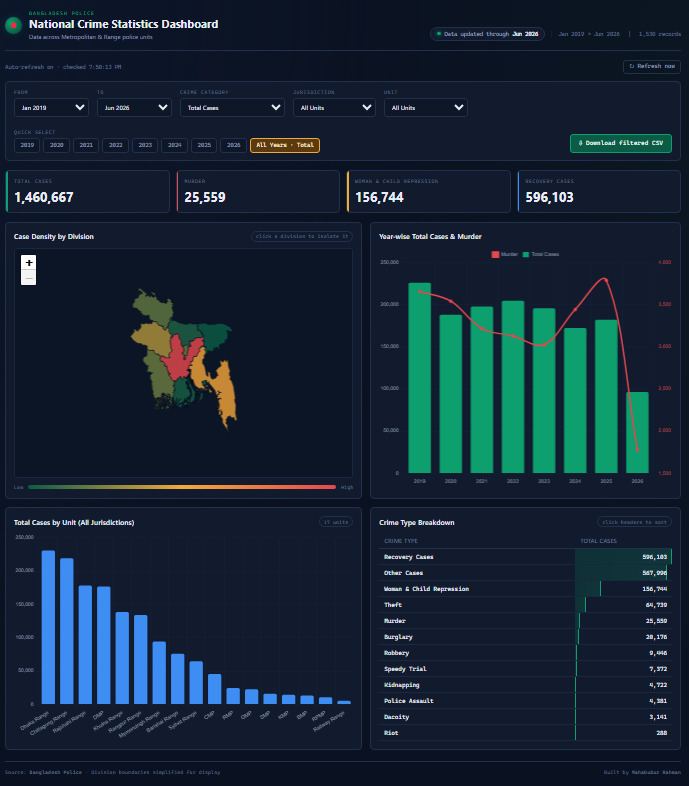

# 🇧🇩 Bangladesh Crime Data

An end-to-end pipeline and dashboard for **monthly crime statistics published by Bangladesh Police** — covering all Metropolitan Police (MP) units and Range/district units, from 2019 to present.

The project automatically scrapes the official Bangladesh Police statistics page, extracts structured data from the published PDF reports using Google's Gemini API, stores it in MySQL, and visualizes it through a live, filterable graph and map dashboard.

**🔗 Live dashboard:** [mahabub-rah.github.io/Bangladesh-Crime-Data](https://mahabub-rah.github.io/Bangladesh-Crime-Data/)
---

--

## ✨ Features

- **Automated data collection** — scrapes [Crime Data](https://www.police.gov.bd/en/january_2020) for newly published monthly crime statistics PDFs, with no manual re-entry.
- **AI-powered extraction** — uses Gemini (`gemini-2.5-flash`) to parse crime statistics tables out of each PDF report into structured JSON.
- **Persistent storage** — inserts every new record into a MySQL database (`crime_data` table) and appends it to yearly SQL archive files (`month_2019.sql` … `month_2026.sql`).
- **Interactive dashboard** (`index.html`) — a Leaflet + Chart.js single-page app that:
  - Renders a choropleth map of Bangladesh by police unit (Division boundaries simplified for display) .
  - Lets users filter by **Range vs. Metropolitan Police** jurisdiction and by specific unit
  - Lets users filter by **date range** and **crime category**
  - Shows KPI summary cards (Total Cases, Murder, Woman & Child Repression, Recovery Cases).
  - Loads directly from `database`, so the dashboard updates automatically whenever the new data is refreshed — no rebuild step required
  - Supports downloading the filtered data

---

## 📁 Repository structure

| File | Description |
|---|---|
| `index.html` | The interactive dashboard (map + charts + filters), deployable as a static site |
| `crime_data.csv` | The full dataset that powers the dashboard (year, month, unit, crime-type columns) |
| `crime_data.sql` | Database schema (`CREATE TABLE crime_data …`) plus a library of ready-to-run summary/report queries |
| `month_2019.sql` … `month_2026.sql` | Yearly append-only SQL insert archives, one file per year |
| `scrape.py` | The scraper/ETL script: Selenium → PDF download → Gemini extraction → MySQL insert → CSV update |

---

## 🗃️ Data schema

Each row represents one police unit's statistics for a given month:

```
year, month, unit,
dacoity, robbery, murder, speedy_trial, riot,
woman_child_repression, kidnapping, police_assault,
burglary, theft, other_cases, recovery_cases, total_cases
```

`unit` covers both **Metropolitan Police** units (e.g. `DMP`, `CMP`) and **Range/district** units.

`crime_data.sql` also includes pre-written aggregate queries (monthly summaries, Range vs. Metropolitan breakdowns, etc.) that are handy starting points for further analysis.

---

## ⚙️ How the pipeline works

1. **Scrape** — `scrape.py` uses Selenium to check the Bangladesh Police statistics page for reports newer than the last recorded update date.
2. **Download** — the newest report PDF is downloaded.
3. **Extract** — the PDF is uploaded to Gemini, which returns the crime statistics table as structured JSON, following a fixed schema.
4. **Load** — the new records are:
   - Appended to the relevant yearly `month_<year>.sql` archive
   - Inserted into the MySQL `crime_data` table
   - Merged into `crime_data.csv` (with de-duplication)
5. **Visualize** — `index.html` reads `crime_data.csv` directly in the browser, so the live dashboard reflects the latest data with no build step.

---
### Run the scraper yourself

**Requirements:**
- Python 3.9+
- Google Chrome + matching [ChromeDriver](https://chromedriver.chromium.org/) (used by Selenium)
- A MySQL database
- A Gemini API key

**Install dependencies:**
```bash
pip install selenium pandas requests google-genai sqlalchemy pymysql python-dotenv
```

**Configure environment variables** in a `.env` file at the repo root:
```env
DB_USER=your_mysql_user
DB_PASSWORD=your_mysql_password
DB_HOST=your_mysql_host
DB_PORT=3306
DB_NAME=crime_statistics
API_KEY=your_gemini_api_key
```

**Set up the database:**
```bash
mysql -u your_mysql_user -p < crime_data.sql
```

**Run the scraper:**
```bash
python scrape.py
```

The script checks for new monthly reports, extracts and loads any new data, and updates `crime_data.csv` in place.

---

## 📊 Data source

All figures are sourced from the official monthly crime statistics reports published by [Bangladesh Police](https://www.police.gov.bd/en/january_2020). This project only automates collection and presentation of publicly available data — it does not modify or interpret the underlying statistics.

---


## 🙋 Author

Maintained by [@mahabub-rah](https://github.com/mahabub-rah).
